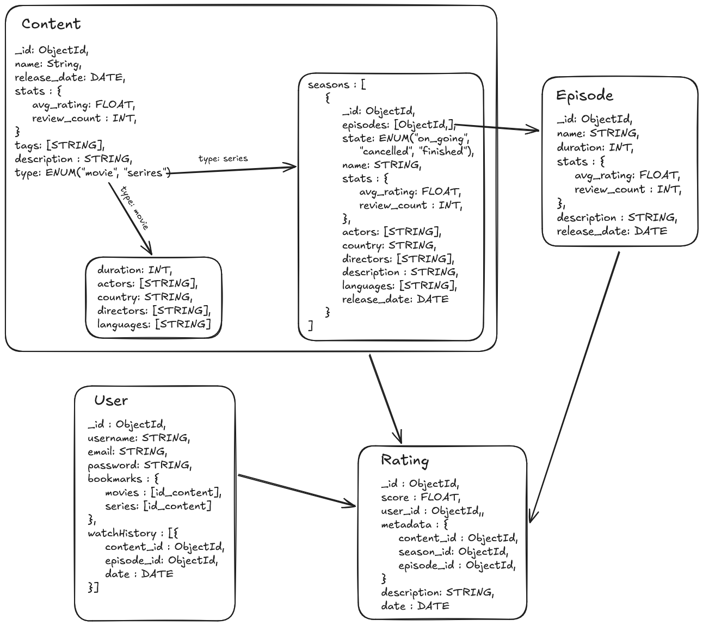

# User Story | StreamHub database
----
## Overview
### Riwi Assignment
This project is an assignment from the module 4, week 3 from Riwi.
### Description
A MongoDB application created for a fictitious organization called StreamHub, working on architecting a structured, scalable, stable NoSQL environment for querying CRUD operations and basic indexing for performance.  
**Status**: Incomplete   
**Language**: English  

----
## NoSQL model


### Entities
Following an object modeling logic rather than the normalization process required to create SQL databases, the collections created are `Content`, `Episode`, `User`, `Rating`.  
The naming for the entities follows the convention for classes, using PascalCase.  
#### Content
This entity has 2 "descendant classes", being a polymorphic collection with the parameters `_id`, `name`, `release_date`, `stats`, `tags`,`description`,`type`.  (these are the attributes that all content inside the platform share, independently of the content type)  
- `_id`: The primary key, index for database operations. This is a unique id created naturally by MongoDB.
- `name`: The name from the content the object represents, it's a string (in SQL databases it would be a VARCHAR)
- `release_date`: Represents the date the series or movie was released, instead of just the year, as the application should be able to manage filtering by seasons.
- `stats`: Is an embebed object, it contains 2 attributes: 
	- `avg_rating`: It represents the average rating given to the content, across all users. In case it's a movie, the average is calculated with the ratings that share the same content id, for series, it's calculated via the average from all seasons (that are calculated from the episodes ratings + ratings given to the series directly)
	- `review_count`: It represents the quantity of ratings given, used to make the calculations for rating updates. 
- `tags`: it's an array that contains the tags given to the contents (Strings), among the tags are the genres (romance, horror, etc.) along with metadata tags like HD, 4k, etc.
- `description`: it's a short description on the content, normally, it's the synopsis.
- `type`: Represents the type of content the object represents, as for this assignment, only 2 options exists : "movie" and "serie", depending on the type, the Content object polymorphs to hold different attributes.   
##### Type: **movie**
Additionally to the attributes inherited from contents, the movies have: `duration`, `actors`, `country`, `directors`, `languages`.
Having in mind the possibility of new types of content added into the application (StreamHub) like podcasts or books, it's clear that not all contents share the same attributes, so instead of being inherited, they are declared inside the movie type.
- `duration`: Represents the duration of the movie in seconds, so it's a integer. This is based on a convention.   
  This decision is based on the fact that operations with integers have no error margin present in float numbers calcs
- `actors`: it's a list/array that contains String representing the names of the actors/actresses present in the movie, this is for querying purposes, as a user may be interested on seeing films from a given actor or actress (or to create statistics)
- `country`: it's a string that represents the name from the movie's production country, the name should be stored in English.
- `directors`: It's a list/array containing strings that represents the movie's director, since there are movies with multiple directors.
- `languages`: A list that contains, in English, the movie languages available.   

**Example**:  
```javascript
{
  _id: ObjectId('69acf48d9c7b8a9755dfb8d0'),
  name: 'Movie',
  release_date: 2026-03-07T15:30:00.000Z,
  stats: {
    avg_rating: 4.5,
    review_count: 178
  },
  tags: [
    'romance',
    'CFI',
    'HD',
    '4k',
    'christmas'
  ],
  description: 'Movie synospsis, protagonist description',
  type: 'movie',
  duration: 7200,
  actors: [
    'Jhonny bravo',
    'cinderella',
    'Hernesto de la cruz',
    'pedrito'
  ],
  country: 'Colombia',
  languages: [
    'English',
    'Spanish'
  ],
  directors: [
    'carlitos'
  ]
}
```
> **Warning**: These examples are only illustrative, they are not fit for a real MongoDB
##### Type: **series**
The series type of content have different attributes and composition from movies, as the series are divided on seasons (there are series with only one season), most of the attributes are embebed inside the object season rather than part of the object series.
The only attribute series has apart from the inherited from content is `seasons`.
- `seasons`: it's an array/list that contains objects that represent the series seasons.
	- `_id`: An identifier for each series season. used for filtering and rating operations.
	- `episodes`: An array/list containing the id's from the episodes related to the season, from the Episode collection.
	- `state`: A string value that represents the state from the season, the values that can take are "on_going" for series on going that are currently producing new episodes, "cancelled" for series/seasons cancelled by any reason, "finished" for seasons that are finished and have no more episodes pending to stream.
	- `name`: A string value that represents the season name, some seasons have different names from the series (for example, the Pokémon series).
	- `stats`: it's an embebed object that contains:
		- `avg_rating`: It represents the average rating given to the season, across all users. for seasons, it is calculated by the average rating on each episode average score plus the average rating given to the season itself. **later, a more thorough explanation will be given** 
		- `review_count`: It represents the quantity of ratings given, used to make the calculations for rating updates. 
	- `actors`: A list containing string that represent the actors and actresses' names present on the given series season.
	- `characters`: A list containing the characters present in the series, can replace actors in animated series where there are no real actors.
	- `country`: A string that represents the series season production country name, in English.
	- `directors`: A list/array that contains strings that represent the series season directors' names. This is a season attribute rather than a series attribute, since a series can have different directors among seasons.
	- `description`: A string representing a short description, normally synopsis, from the series season.
	- `languages`: A list/array that contains string representing the series season available languages' names, in English. 
	- `release_date`: It represents the series season release data, additionally the first series season release date is normally equal to the overall series release date.  

**Example**:
```javascript
{
  _id: ObjectId('69bc194f61a8118d2f1ab8fb'),
  name: 'Series',
  release_date: 2024-03-07T15:30:00.000Z,
  stats: {
    avg_rating: 4.5,
    review_count: 178
  },
  tags: [
    'romance',
    'fantasy',
    'HD',
    '4k',
    'adventure',
    'animated'
  ],
  description: 'series synospsis, protagonist description',
  type: 'series',
  seasons: [
    {
      _id: ObjectId('69bc194f61a8118d2f1ab8fa'),
      episodes: [
        ObjectId('69bc1b4861a8118d2f1ab8fc')
      ],
      state: 'finished',
      name: 'Series Orange',
      stats: {
        avg_rating: 0,
        review_count: 0
      },
      characters: [
        'ash',
        'pickachu'
      ],
      country: 'Japan',
      directors: [
        'Ken Yamamoto'
      ],
      description: 'Series new season, ash goes and makes his animal pets fight',
      languages: [
        'Japanese',
        'Spanish',
        'English'
      ],
      release_date: 2026-03-07T15:30:00.000Z
    }
  ]
}
```
> **Warning**: These examples are only illustrative, they are not fit for a real MongoDB
> To insert an \_id inside an nested object it's enough to use \_id = new ObjectId()
#### Episode
This collection holds the episodes from a series season, it's attributes are:  
`_id`, `name`, `duration`, `stats`, `description`, `release_date`;
- `_id`:  it's an ObjectId value from MongoDB. the episode primary key .
- `name`: a string that represents the episode name, in case the episode does not have a name, it should get a default value of "episode *episode_number*" where episode_number is the number of the episode inside it's corresponding season.
- `duration`: The episode's duration in seconds (in case the amount of seconds it's not an integer number, the number must be rounded to the next available integer) 
- `stats`: an embebed object that contains the attributes: 
	- `avg_rating`: a float number that represents the average rating given by the users to the given episode, it's updated when a new rating to with the episode id is given.
	- `review_count`: The number of reviews a given episode has. it's used to calculate the average rating
- `description`: A string that represents a simple episode description, if the episode does not have one, it can be omitted.
- `release_date`: it contains the episode release date.  

Episodes are referenced inside the `content` collection, specifically by the `type` "series" content, inside the `episodes` list that is inside the embebed object that represents a season, inside the `seasons` list attribute.  
**example**:
```javascript
{
  _id: ObjectId('69bc1b4861a8118d2f1ab8fc'),
  name: 'The great war begins',
  duration: 1200,
  stats: {
    avg_rating: 0,
    review_count: 0
  },
  description: 'Todorito starts the great war against the great pedrito empire',
  release_date: 2024-02-07T15:30:00.000Z
}
```
> **Warning**: This is only an example and it's not fit for a real MongoDB
#### User
This collection holds the basic information for users, and although it's a bad practice to store the passwords inside a database, and it's normally recommended to maintain all delicate information elsewhere, given the characteristics from the Assignment, the passwords are stored in the User collection, although they are hashed.   
The user collection has the attributes: `_id`, `username`, `email`, `password`, `bookmarks`, `whatchHistory`.  
- `_id`: Primary key, it's an ObjectId from MongoDB.
- `username`: String that represents the user's username, it must be unique, as it should be used for login (like platforms as GitHub).
- `email`: String that represents the user's email, must be unique and have a valid email structure. 
- `password`: String that represents the user password, it must not be unique, but it must be hashed. There exists methods to hash passwords differently using the username or other user's parameters to create a perfectly unique hashed password and prevent regression type attacks (Creating various accounts to see how they are hashed, and search for users inside the database with the same hashed password to steal the accounts)
- `bookmarks`: An embebed object that contains the attributes: 
	- `movies`: Contains the movies the user has bookmarked, it's a list of content type movie ids.
	- `series`: Contains the series the user has bookmarked, it's a list of content type series ids. The capacity for the user to bookmark only a given season from a series it's not contemplated.
- `wathcHistory`: A list/Array that contains embebed objects that contain the following attributes:
	- `content_id`: the content id the user has seen. Applies for any content type.
	- `episode_id`: the episode id the user has seen. It's optional and only applies if the user has seen an episode from a serie (The absence from this attribute in the object means it corresponds to a movie, useful for querying)
	- `date`: The date and possibly time the user watched the content.  

The users don't hold any more information, there are no admins, as the dashboard for administration it's not mentioned inside the assignment. It can be thought that the administration for the page is being made from a third party service.  
```javascript
{
  _id: ObjectId('69acfb1c9c7b8a9755dfb8d1'),
  username: 'pedrito_core',
  email: 'predrito@pedrito.dev',
  password: 'dc12e653439f07e6b0ee268b5559b45bb99be057dd7edd8756d77ef96b21aaee',  //it's "mysecure@password" hashed with python hashlib library
  bookmarks: {
    movies: [],
    series: []
  },
  watchHistory: []
}
```
> **Warning**: This is only an example and it's not fit for a real MongoDB  

#### Rating
This collection holds the rankings given by all users to a given content inside the application (StreamHub), when a new rating it's created, it's necessary to calculate and update the ranking attributes inside the corresponding content.   
The Rating collection attributes are: `_id`,`score`, `user_id`, `metadata`, `description`, `date`;
- `id`: The primary key, since this is not a SQL database, instead of a composed primary key, the rating has it's own primary key ObjectId, a composed key will be problematic, as other than the user id, other foreign ids are inside the metadata embebed object. 
- `score`: The score given by the user, it's a float number in \[0, 5\] range, rounded to have only one decimal number.  (As rating it's normally done with stars, a rating usually it's a float number with .5 decimal score, or an integer ϵ \[1,5\])
- `metadata`: it's an embebed object that contains the rated content data (ids):
	- `content_id`: The content collection object/document `_id`.
	- `season_id`: The content type series season `_id`, it's optional, and only present if the user is giving the review to the season directly or an episode.
	- `episode_id`: The rated episode `_id`, it's optional and only appears in case the user is rating a series episode, as movies don't have episodes. 
	- `user_id`: The `_id` from the user reviewing, it's inside rating as MongoDB has a limit of 16MB per document, and a very active user on the course of many years can very well get over that limit. 
- `description`: String that represents an optional user written message in the review. Must make sure it follows the application terms and services. 
- `date`: The date and possibly time the review was made.   

The Rating collection it's not made with the intention of allowing the user to upload multimedia content, and it follows the purpose of both a review and comments, similarly to applications like the Play Store.   
```javascript
{
  _id: ObjectId('69bc2beb61a8118d2f1ab8fe'),
  score: 3.5,
  metadata: {
    content_id: ObjectId('69bc194f61a8118d2f1ab8fb'),
    season_id: ObjectId('69bc194f61a8118d2f1ab8fa'),
    episode_id: ObjectId('69bc1b4861a8118d2f1ab8fc'),
    user_id: ObjectId('69acfb1c9c7b8a9755dfb8d1')
  },
  date: 2026-03-07T15:30:00.000Z
}
```
> **Warning**: This is only an example and it's not fit for a real MongoDB  

----
## Data Insertion

### MongoDB docker installation
For this assignment, I will be creating a MongoDB container using docker. 
> If you want recreate, make sure you have docker installed
- create MongoDB docker image and container:
	```bash
	 docker run --name mongo-server -p 27017:27017 -e MONGO_INITDB_ROOT_USERNAME=root -e MONGO_INITDB_ROOT_PASSWORD=password -d mongo
	```
	> Change "mongo-server" for the name of your server, if port 27017 is occupied, change the left port.   
	> Change "password" for your selected password, and change "root" to assign a different username.
- Install MongoDB Compass to use MongoDB shell
	- Alternatively, you can use the MongoDB library from node.js 
### Data population
Once MongoDB is ready and running, create a new database: `db_streamhub`.  
Create the collections:  `User`, `Content`, `Rating`, `Episode`;  
> The MongoDB library usually creates automatically the collections.  
- Start creating example users: 
```javascript
//Create an example user:
db.User.insertOne({
  //id is automatically created
  username: "pedrito_core",
  email: "predrito@pedrito.dev",
  password: "dc12e653439f07e6b0ee268b5559b45bb99be057dd7edd8756d77ef96b21aaee", //it's "mysecure@password" hashed with python hashlib library
  bookmarks: {
    movies:[],
    series:[]
  },
  watchHistory: []
})
```
- Once created, you can set indexes for email and username:
```javascript
// create unique username index for user
db.User.createIndex({ "username": 1 }, { unique: true });

// create unique email index for user
db.User.createIndex({ "email": 1 }, { unique: true });
```
> This is only made one time, when the first user is created.
#### Task 3: Queries (Reading) with Operators

**What they are asking:**
This is where you retrieve data from your collections using the `find()` command. The key here is to use MongoDB's rich set of query operators to filter the results. They specifically mention `$gt`, `$lt`, `$eq`, `$in`, `$and`, `$or`, and `$regex`.

**Command to Use:**
*   `db.collection.find({ <query_filter> })`

**Overview and Examples:**
The `find()` command takes a filter document. You specify the field and the condition you want to match.

*   **Comparison Operators (`$gt`, `$lt`, `$eq`):** These stand for "greater than," "less than," and "equal to."
    ```javascript
    // Find movies with a duration GREATER THAN 120 minutes ($gt)
    db.movies.find({ durationMinutes: { $gt: 120 } });

    // Find users who have watched FEWER THAN 5 items in their history ($lt)
    // Note: This requires checking the size of an array, which might need a different approach
    ```

*   **Logical Operators (`$and`, `$or`):** These allow you to combine multiple conditions.
    ```javascript
    // Find Sci-Fi movies released AFTER 2010 ($and)
    db.movies.find({
      $and: [
        { genre: "Sci-Fi" },
        { releaseYear: { $gt: 2010 } }
      ]
    });
    // This can also be written more simply as:
    db.movies.find({ genre: "Sci-Fi", releaseYear: { $gt: 2010 } });
    ```

*   **Array Operator (`$in`):** Checks if a field's value matches any value in a specified array.
    ```javascript
    // Find movies whose genre is either 'Action' or 'Adventure' ($in)
    db.movies.find({ genre: { $in: ["Action", "Adventure"] } });
    ```

*   **Regular Expression Operator (`$regex`):** Allows for powerful pattern matching on strings.
    ```javascript
    // Find all movies whose title STARTS with "The" ($regex)
    db.movies.find({ title: { $regex: "^The" } });
    ```
*You will need to construct `find()` queries using these operators to answer the specific questions posed in the task, like finding users who have watched more than 5 items.*

#### Task 4: Updates and Deletions

**What they are asking:**
Now you need to modify existing data and remove data. You'll use `updateOne`/`updateMany` for modifications and `deleteOne`/`deleteMany` for removals.

**Commands to Use:**
*   `db.collection.updateOne({ <filter> }, { <update> })`
*   `db.collection.deleteOne({ <filter> })`

**Overview and Examples:**

*   **`updateOne()`**: Finds the *first* document that matches the filter and applies the update. The second argument uses special "update operators" like `$set`, `$inc`, `$push`.
    ```javascript
    // Example: Update the rating of a specific movie ($set)
    db.movies.updateOne(
      { title: "Inception" }, // Filter: find this movie
      { $set: { averageRating: 4.8 } } // Update: set this field
    );

    // Example: Add a new review to a movie's review array ($push)
    db.movies.updateOne(
      { title: "Inception" },
      { $push: { reviews: { user: "alice", comment: "Mind-bending!" } } }
    );
    ```

*   **`deleteOne()`**: Finds the *first* document that matches the filter and removes it from the collection.
    ```javascript
    // Example: Delete a user by their username
    db.users.deleteOne({ username: "olduser" });
    ```
*Your task is to write similar commands to perform the updates and deletions described, such as updating a content's rating.*

#### Task 5: Indexes for Performance

**What they are asking:**
This task is about optimization. After you've created your collections and run some queries, you need to make those queries faster. You do this by creating indexes on fields that are frequently used in your `find()` filters (like `title` or `genre`). You also need to verify that the indexes were created correctly.

**Commands to Use:**
*   `db.collection.createIndex({ <field>: <order> })`
*   `db.collection.getIndexes()`

**Overview and Examples:**

*   **`createIndex()`**: This command tells MongoDB to build an index on a specific field. The order `1` means ascending, `-1` means descending. For simple lookups, `1` is standard.
    ```javascript
    // Example: Create an ascending index on the 'genre' field of the 'movies' collection
    db.movies.createIndex({ genre: 1 });

    // Example: Create a compound index on both 'genre' and 'releaseYear'
    // This is very efficient for queries that filter by both fields.
    db.movies.createIndex({ genre: 1, releaseYear: -1 });
    ```

*   **`getIndexes()`**: This command lists all the indexes that currently exist on a collection. Every collection automatically has an index on its `_id` field.
    ```javascript
    // Example: See all indexes on the 'movies' collection
    db.movies.getIndexes();
    /*
    Output might look like:
    [
      { v: 2, key: { _id: 1 }, name: "_id_" },
      { v: 2, key: { genre: 1 }, name: "genre_1" }
    ]
    */
    ```
*For this task, you should identify which fields from your queries in Task 3 would benefit from an index, create them, and then use `getIndexes()` to confirm they are there.*

By following this guide, you should have a solid understanding of what each part of the assignment requires and the specific tools (MongoDB commands) you need to use to complete it. Good luck
