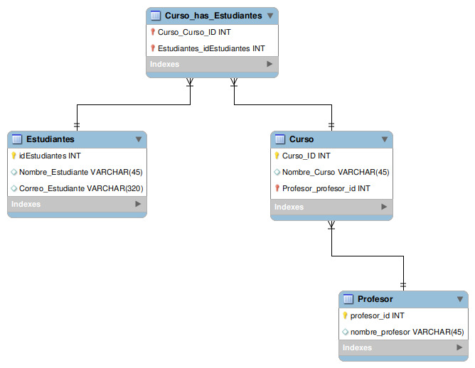

# Normalization Work 1

## Overview
**Note**: This works is an assigment given in Riwi to understand the basics of model creation for databases and normalization.  
**Description**: Normalize a database based on a unorganized table (entity), following de normalize formal norms  
**Language**: Spanish
### Asigment criteria
- Define main entities, their attributes and relations
- The design applies the normalization norms and all names are lowercase
- The Relational Model displays correctly the attributes, types of data and relationships among entities
- The primary keys, foreign keys and unique attributes are correctly indentified

## Methodology
This project is based on the following normalization norms:
- **First Formal Norm**
    - All data inside a table cell must be indivisible
    - Every row must be unique and can't contain repeated groups of data
- **Second Formal Norm**
    - Delete all parcial dependencies
    - All tables must follow the First Formal Norm
- **Third Formal Norm**
    - Delete all transitive dependencies
    - All tables must follow the Second Formal Norm

## Content

### Entities
- **Estudiates**: This is the main entity from the database, it has name, id and *unique* email.
- **Curso**: This entity is independient in the problem, it has a name, id and a Profesor.
- **Profesor**: This entity is independient, it has a name and id.
- **Curso_has_Estudiantes**: This entity is dependent, it has a composed primary key, formed by the primary keys from the entities Estudiantes and Curso.
### Relationships
- Estudiantes has a multiple to multiple relationship with Curso, as a student has multiple courses, and a course contains multiple students.
- Profesor has a multiple to one relationship with Curso, as a teacher has multiple courses, but a course has only a techer.
### Normalization
- **Correct**
    - All data iside the entities is indivisible, there are no lists.
    - All data possess only direct dependencies.
- **Wrong**
    - Not all names are on lower case
    - Not naming conventions for entities names