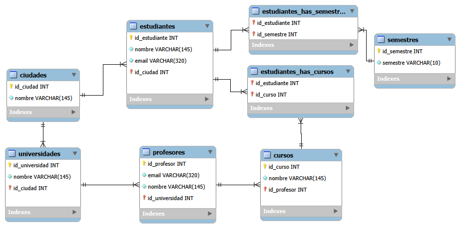

# Normalization Work 2

## Overview
**Note**: This works is an assigment given in Riwi to understand the basics of model creation for databases and normalization.  
**Description**: Normalize a database based on a unorganized table (entity), following de normalize formal norms  
**Language**: Spanish
### Asigment criteria
- Define main entities, their attributes and relations
- The design applies the normalization norms and all names are lowercase
- The Relational Model displays correctly the attributes, types of data and relationships among entities
- The primary keys, foreign keys and unique attributes are correctly indentified

## Methodology
This project is based on the following normalization norms:
- **First Formal Norm**
    - All data inside a table cell must be indivisible
    - Every row must be unique and can't contain repeated groups of data
- **Second Formal Norm**
    - Delete all parcial dependencies
    - All tables must follow the First Formal Norm
- **Third Formal Norm**
    - Delete all transitive dependencies
    - All tables must follow the Second Formal Norm

## Content

### Entities
- **estudiates**: This is the main entity from the database, it has name, id, *unique* email and city.
- **cursos**: This entity is independient, it has a name, a profesor and id.
- **profesores**: This entity is independient, it has a name, *unique* email, id and a university
- **universidades**: This entity is independent, it has a name, id and a city.
- **ciudades**: This entity is independient, it has a name and id.
- **semestres**: This entity is independient, it has a semestre attribute and id.
- **estudiantes_has_semestres**: This entity is dependent, it's primary key is composed from the primary keys from estudiantes and semestres.
- **estudiantes_has_cursos**: This entity is dependent, it's primary key is composed from the primary keys from estudiantes and cursos.
### Relationships
- estudiantes has a multiple to multiple relationship with cursos, as a student has multiple courses, and a course contains multiple students.
- profesores has a multiple to one relationship with cursos, as a teacher has multiple courses, but a course has only a techer.
- estudiantes has a multiple to multiple relationship with semestres, as a student gets into various semesters along it's career, and a semester has multiple students.
- universidades has a multiple to one relationship with ciudades, as a city can have a lot of universities inside, but a given university is only in a city.
- profesores has a multiple to one relationship with universidades, as a university can have a lot of teachers, but a teacher is at one university at the time.
- estudiantes has a multiple to one relationship with ciudades, as multiple students live in a city, but a student can only live at one city at the time.

### Normalization
- **Correct**
    - All data iside the entities is indivisible, there are no lists.
    - All data possess only direct dependencies.
    - All names are lower case
    - Entities names follow the convention lower case, plural.
- **Wrong**
    