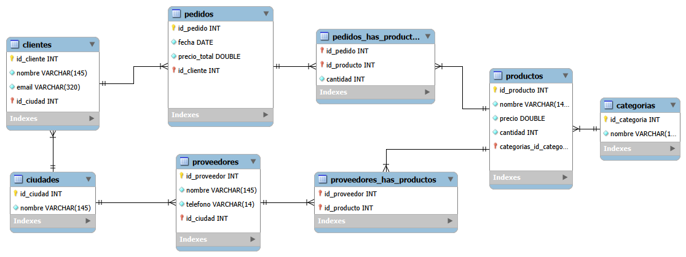

# Normalization Work 3

## Overview
**Note**: This works is an assigment given in Riwi to understand the basics of model creation for databases and normalization.  
**Description**: Normalize a database based on a unorganized table (entity), following de normalize formal norms  
**Language**: Spanish
### Asigment criteria
- Define main entities, their attributes and relations
- The design applies the normalization norms and all names are lowercase
- The Relational Model displays correctly the attributes, types of data and relationships among entities
- The primary keys, foreign keys and unique attributes are correctly indentified

## Methodology
This project is based on the following normalization norms:
- **First Formal Norm**
    - All data inside a table cell must be indivisible
    - Every row must be unique and can't contain repeated groups of data
- **Second Formal Norm**
    - Delete all parcial dependencies
    - All tables must follow the First Formal Norm
- **Third Formal Norm**
    - Delete all transitive dependencies
    - All tables must follow the Second Formal Norm

## Content

### Entities
- **clientes**: This is the main entity from the database, it has name, id, *unique* email and city.
- **pedidos**: This entity is independient, it has a date, a total price, id and a client.
- **proveedores**: This entity is independient, it has a name, *unique* phone number, id and a city
- **productos**: This entity is independent, it has a name, id, price, amount(stock) and a category.
- **ciudades**: This entity is independient, it has a name and id.
- **categorias**: This entity is independient, it has a name and id.
- **pedidos_has_productos**: This entity is dependent, it's primary key is composed from the primary keys from pedidos and productos. it has a quantity attribute, it refers to the amount of the given product is in said order.
- **proveedores_has_productos**: This entity is dependent, it's primary key is composed from the primary keys from productos and proveedores.
### Relationships
- pedidos has a multiple to one relationship with clientes, as a client can make multiple orders, but an order is made by a client at a time.
- proveedores has a multiple to one relationship with ciudades, as a city is where multiple suppliers reside but a supplier only resides in a city at a time.
- clientes has a multple to one relationship with ciudades, as a city is where multiple clients reside but a client only resides in a city at a time.
- productos has a multiple to one relationship with categorias, as a category contains multiple products, but a product can have only one category at a time.
- proveedores has a multiple to multiple relationship with productos, as a product can have multiple suppliers, and a supplier can provide multiple products.
- pedidos has a multiple to multiple relationship with productos, as a product can be on multiple orders, and an order can have multiple products.

### Normalization
- **Correct**
    - All data iside the entities is indivisible, there are no lists.
    - All data possess only direct dependencies.
    - All names are lower case
    - Entities names follow the convention lower case, plural.
- **Wrong**
    