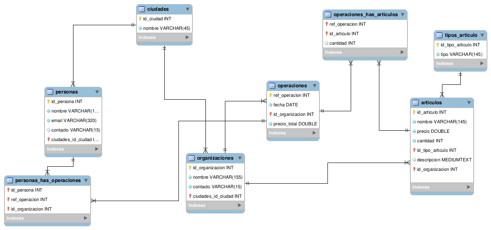

# Normalization Work 4

## Overview
**Note**: This works is an assigment given in Riwi to understand the basics of model creation for databases and normalization.  
**Description**: Normalize a database based on a unorganized table (entity), following de normalize formal norms  
**Language**: Spanish
### Asigment criteria
- Define main entities, their attributes and relations
- The design applies the normalization norms and all names are lowercase
- The Relational Model displays correctly the attributes, types of data and relationships among entities
- The primary keys, foreign keys and unique attributes are correctly indentified

## Methodology
This project is based on the following normalization norms:
- **First Formal Norm**
    - All data inside a table cell must be indivisible
    - Every row must be unique and can't contain repeated groups of data
- **Second Formal Norm**
    - Delete all parcial dependencies
    - All tables must follow the First Formal Norm
- **Third Formal Norm**
    - Delete all transitive dependencies
    - All tables must follow the Second Formal Norm

## Content

### Entities
- **personas**: This is the main entity from the database, it has name, id, *unique* email, *unique* contact, and city.
- **operaciones**: This entity is independient, it has a date, a total price, id (ref) and a organization.
- **organizaciones**: This entity is independient, it has a name, *unique* contact, id and a city
- **articulos**: This entity is independent, it has a name, id, price, amount(stock), description, category and a organization.
- **ciudades**: This entity is independient, it has a name and id.
- **tipos_articulo**: This entity is independient, it has a type attribute and id.
- **personas_has_operaciones**: This entity is dependent, it's primary key is composed from the primary keys from personas, organizaciones and operaciones.
- **operaciones_has_articulos**: This entity is dependent, it's primary key is composed from the primary keys from operaciones and articulos. It has a quantity attribute, it refers to the amount of the given article is in said operation.
### Relationships
- articulos has a multiple to one relationship with organizaciones, as an organization has multiple articles, but an article is from an organization at a time.
- organizaciones has a multiple to one relationship with ciudades, as a city is where multiple organizations reside but a organization only resides in a city at a time.
- personas has a multple to one relationship with ciudades, as a city is where multiple people reside but a person only resides in a city at a time.
- articulos has a multiple to one relationship with tipos_articulos, as a article type contains multiple articles, but an article can have only one type at a time.
- operaciones has a multiple to one relationship with organizaciones, as an organization can make multiple operations, but an operation can have only one organization at a time.
- personas has a multiple to multiple relationship with operaciones, as a person can have multiple operations, and a operation can be made by multiple people.
- operaciones has a multiple to multiple relationship with articulos, as an article can be on multiple operations, and an operation can have multiple articles.

### Normalization
- **Correct**
    - All data iside the entities is indivisible, there are no lists.
    - All data possess only direct dependencies.
    - All names are lower case
    - Entities names follow the convention lower case, plural.
- **Wrong**
    - personas and operaciones may have a multiple to one relationship, a person having multiple operations and an operation with only a client at a time.
    - organizaciones and articulos may have multiple to multiple relationship, an article can be on multiple organizations and a organization can have multiple articles (It could have a different price though)
    - the entity personas_has_operaciones could have only id_persona and ref_operacion, as id_organization depends on the operation and not directly from personas.