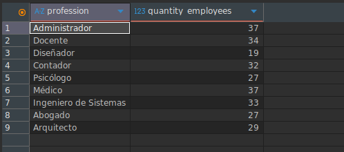
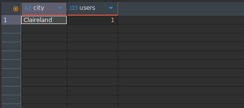
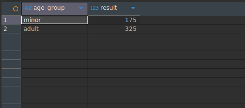
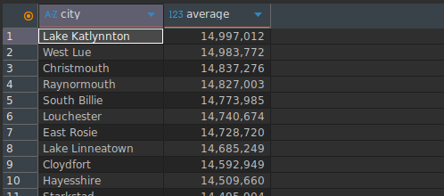
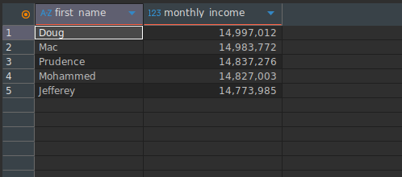

# Level four
## overview
Fundamentals, Analitic thinking
The following are DQL (Data Query Comamands):
### Important
All instructions are based on a unique database context.
## Contents
|objective|SQL|result|description|
|----|-----|-------|----|
|show professions with more than 10 users|```SELECT profession, COUNT(*) AS 'quantity_employees' FROM users u WHERE profession IS NOT NULL GROUP BY u.profession HAVING COUNT(*) > 10;```||The command filters users whose profession is not NULL, groups them by profession, and counts how many users belong to each profession. The HAVING clause restricts the result to only those professions with more than 10 users.|
|show the city with the highest number of users|```SELECT city, COUNT(*) AS 'users' FROM users u GROUP BY u.city ORDER BY 'users' LIMIT 1;```||The command groups users by city and counts how many users exist in each one. The result is ordered by the users count and limited to one record, returning the city with the highest number of registered users.|
|compare number of minors vs adults|```SELECT CASE WHEN birth_date > '2008-01-01' THEN 'minor' ELSE 'adult' END AS age_group, COUNT(*) AS result FROM users u GROUP BY age_group;```||The command uses a CASE expression to classify users into two categories: 'minor' (birth_date after '2008-01-01') and 'adult' (otherwise). It then groups the results by age_group and counts how many users belong to each category.|
|calculate average income per city ordered from highest to lowest|```SELECT city, AVG(u.monthly_income) AS average FROM users u WHERE u.monthly_income IS NOT NULL GROUP BY city, u.monthly_income HAVING COUNT(*) > 0 ORDER BY average DESC;```||The command filters users with non-null monthly_income, groups the records by city (and monthly_income as defined in the query), calculates the average income for each group, and orders the results from highest to lowest average income.|
|show the top 5 users with the highest income|```SELECT first_name, monthly_income FROM users u WHERE u.monthly_income IS NOT NULL GROUP BY u.first_name,u.monthly_income ORDER BY u.monthly_income DESC LIMIT 5;```||The command filters users whose monthly_income is not NULL, groups the results by first_name and monthly_income, orders them in descending order by income, and limits the output to the top 5 highest income records.|

