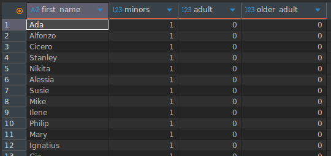
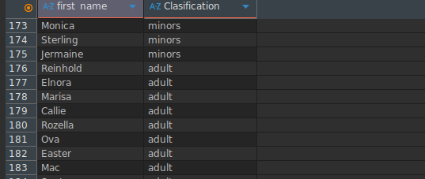
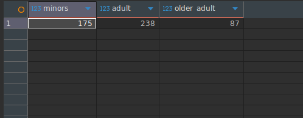
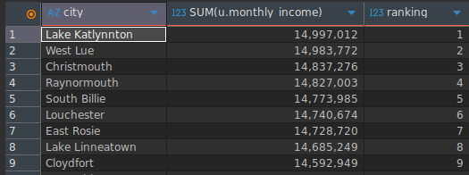
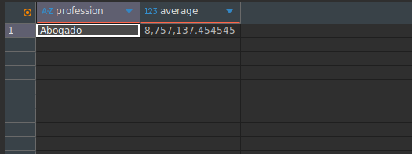
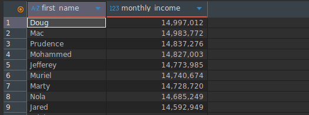

# Level five
## overview
Fundamentals, engineer level
The following are DQL (Data Query Comamands):
### Important
All instructions are based on a unique database context.
## Contents
|objective|SQL|result|description|
|----|-----|-------|----|
|classify users as minor, adult, or older adult (method 1 - conditional counting)|```SELECT first_name, COUNT(CASE WHEN birth_date >= '2008-01-01' THEN 0 END) AS minors, COUNT(CASE WHEN birth_date BETWEEN '1970-01-01' AND '2008-01-01' THEN 0 END) AS adult, COUNT(CASE WHEN birth_date <= '1970-01-01' THEN 0 END) AS older_adult FROM users u GROUP BY first_name, u.birth_date ORDER BY u.birth_date DESC;```||The command groups users by first_name and birth_date, and uses conditional COUNT expressions to classify them into three categories: minors, adults, and older adults according to their birth_date. The results are ordered from the most recent birth_date to the oldest.|
|classify users as minor, adult, or older adult (method 2 - CASE expression)|```SELECT first_name, CASE WHEN birth_date >= '2008-01-01' THEN 'minors' WHEN birth_date BETWEEN '1970-01-01' AND '2008-01-01' THEN 'adult' ELSE 'older_adult' END AS Clasification FROM users u GROUP BY first_name, u.birth_date ORDER BY u.birth_date DESC;```||The command uses a CASE expression to assign a textual classification (minors, adult, or older_adult) to each user based on birth_date. The results are grouped and ordered by birth_date in descending order.|
|count total users in each age classification|```SELECT COUNT(CASE WHEN birth_date >= '2008-01-01' THEN 0 END) AS minors, COUNT(CASE WHEN birth_date BETWEEN '1970-01-01' AND '2008-01-01' THEN 0 END) AS adult, COUNT(CASE WHEN birth_date <= '1970-01-01' THEN 0 END) AS older_adult FROM users u;```||The command calculates the total number of users in each age category (minors, adults, and older adults) using conditional COUNT expressions without grouping individual users. The result returns a single row with the totals per classification.|
|rank cities by total monthly income|```SELECT city, SUM(u.monthly_income), RANK() OVER (ORDER BY SUM(u.monthly_income) DESC) AS ranking FROM users u GROUP BY u.city;```||The command groups users by city and calculates the total monthly_income per city using SUM. It then applies the RANK() window function to assign a ranking based on total income in descending order. Cities with higher total income receive better ranking positions.|
|show profession with the highest average income|```SELECT profession, AVG(u.monthly_income) AS average FROM users u GROUP BY u.profession ORDER BY average DESC LIMIT 1;```||The command groups users by profession, calculates the average monthly_income for each profession, orders the results from highest to lowest average, and limits the output to one record, returning the profession with the highest average income.|
|show users whose income is above the overall average|```SELECT first_name, monthly_income FROM users u WHERE u.monthly_income > (SELECT AVG(u.monthly_income) FROM users u) ORDER BY u.monthly_income DESC;```||The command uses a subquery to calculate the general average monthly_income and filters users whose income is greater than that value. The results are ordered from highest to lowest income.|