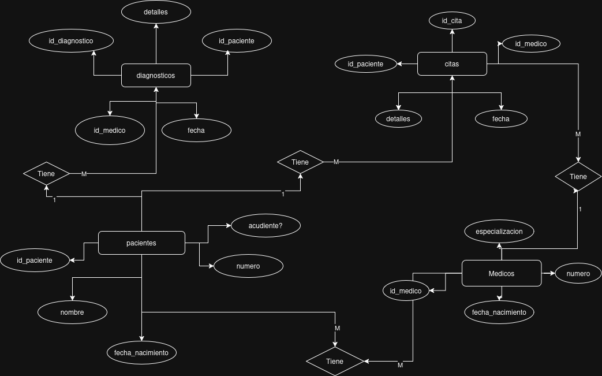
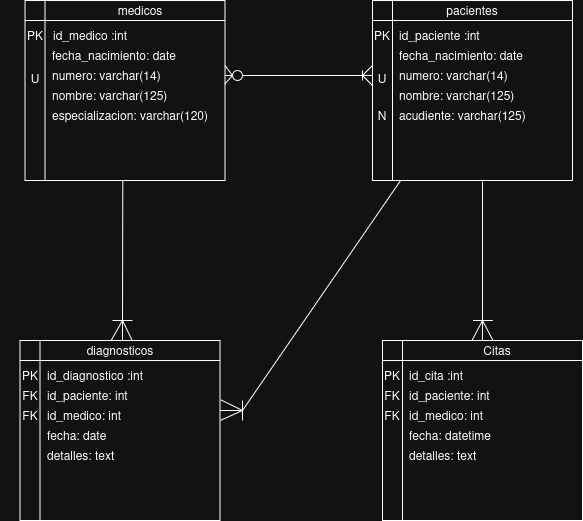

# User Story 1
## [Github Repository](https://github.com/SrLampi1001/historia_usuario_1_m4)
## Overview:
**Note**: This works is an assigment given in Riwi to understand the basics of model creation for databases and normalization.  
**Description**: Creating a concept and logic design for the database (relational model) as a analist inside a imaginary company 'vida sana'.  
The entities that need to be managed are petients, doctors, appointments and diagnosis.  
**Language**: English
### Asigment criteria
- Define main entities, their attributes and relations
- The design applies the normalization norms
- The DER/ERD (Diagrama Entidad-Relacion/Entity Relationship Diagram) and Relational Model are equal
- The primary keys, foreign keys and unique attributes are correctly indentified

## Folder structure
```
historia_usuario_1_m4/
├── DER.png
├── ModeloRelacional.png
└── README.md
```
## Content


## Methodology
This project is based on the following normalization norms:
- **First Formal Norm**
    - All data inside a table cell must be indivisible
    - Every row must be unique and can't contain repeated groups of data
- **Second Formal Norm**
    - Delete all parcial dependencies
    - All tables must follow the First Formal Norm
- **Third Formal Norm**
    - Delete all transitive dependencies
    - All tables must follow the Second Formal Norm

